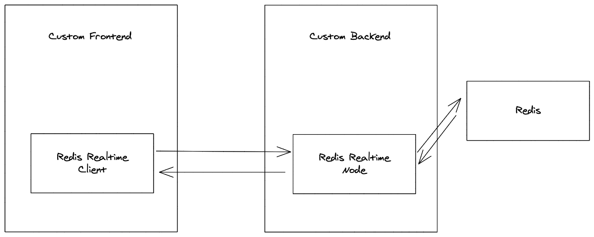
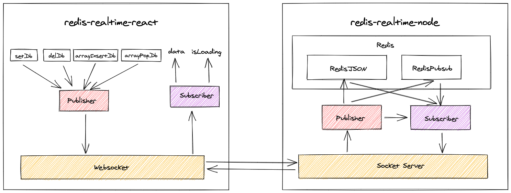

# Redis Realtime
Build realtime services on top of redis

A live demo of redis realtime is available [here](https://redis-realtime-demo.herokuapp.com/)

## What is Redis Realtime?
For now redis-realtime is a set of packages for react and node js that can be used to build scalable realtime services on top of redis. 



## Packages
### redis-realtime-react
This is a react package that help you to easily connect with the redis with the help redis-realtime-node package and update the database. More information on the package is available on its [readme](./packages/redis-realtime-react/README.md).


### redis-realtime-nodejs
This is the nodejs sdk that will be used my redis-realtime-react to communicate redis. More information on the package is available on its [readme](./packages/redis-realtime-node/README.md).

## Running Locally
This project is a monorepo with the packages and a example and it uses npm workspaces to manage them locally.

### Prerequisites
- Requires npm v7 or above.
- Ideal nodejs version v14.8
- Redis running with RedisJson Module. You can use this [docker-compose.yml](./examples/realtime-be/docker-compose.yml)

### Run examples locally
Install the dependencies
```
npm install
```

Now you have to build the packages.
```sh
npm --prefix packages/redis-realtime-node run build
npm --prefix packages/redis-realtime-react run build
```

Start the backend server
```
cd example/realtime-be && npm start
```

Start the frontend
```
cd example/realtime-fe && npm run dev
```

## Detailed Architecture
Redis realtime packages detailed architecture.


